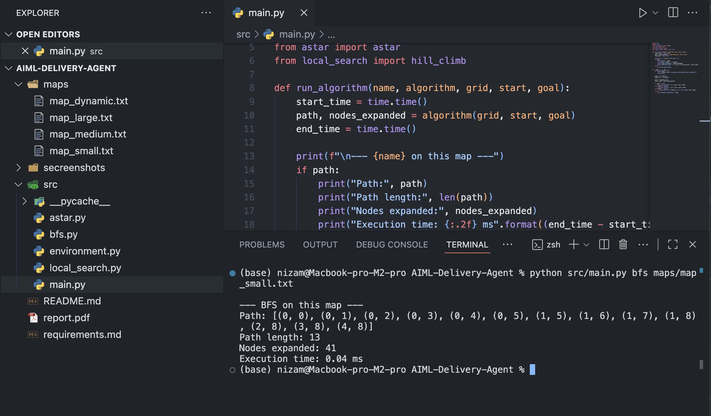
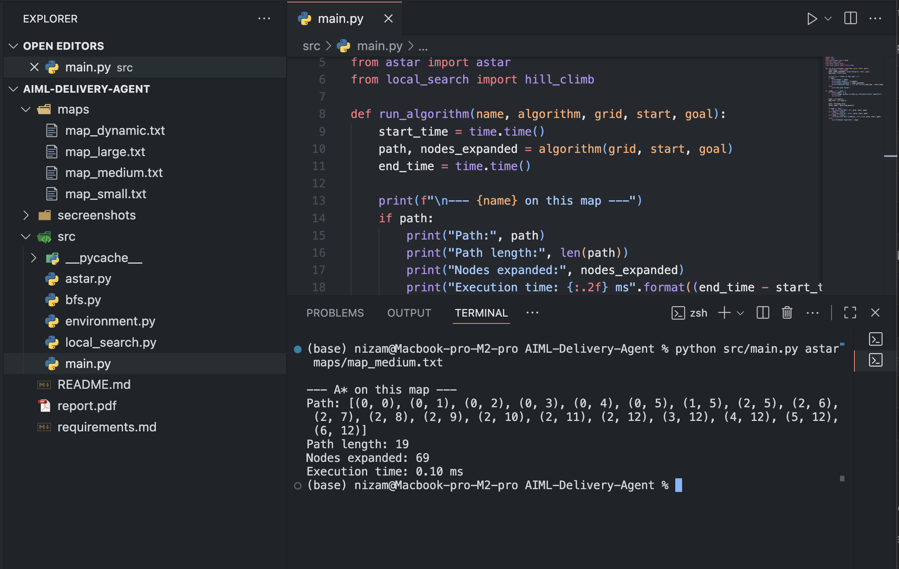
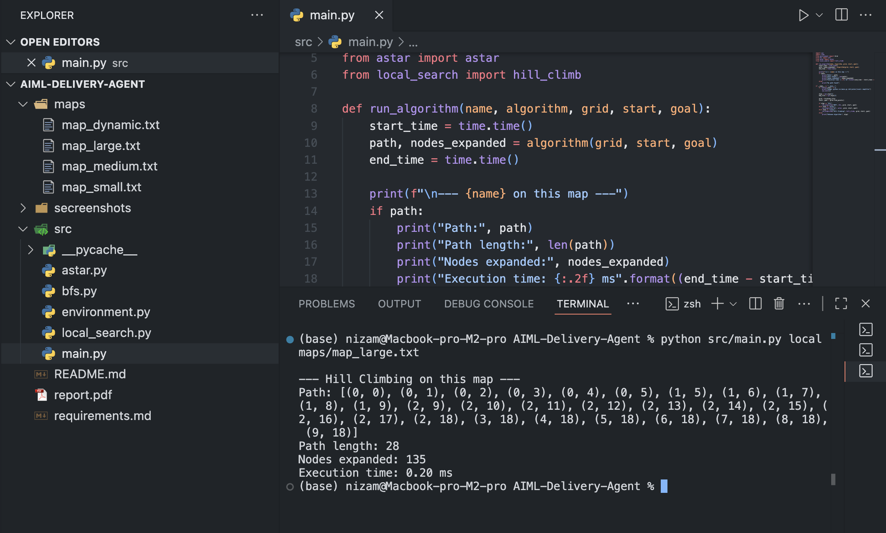
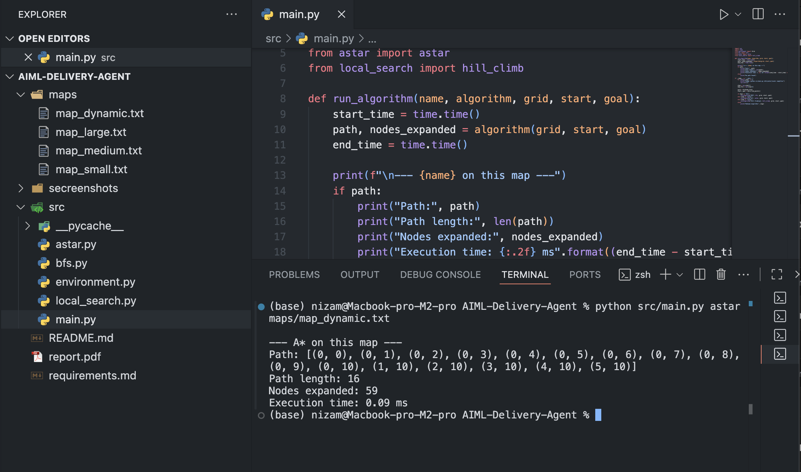

#  AIML Delivery Agent – Search Algorithms

#  Overview
This project implements an autonomous delivery agent navigating a 2D grid city using search algorithms.  
The agent moves from a Start (S) to a Goal (G) while avoiding obstacles (X).  

Algorithms implemented:
- BFS (Breadth-First Search – uninformed)
- A* (informed search with Manhattan heuristic)
- Hill Climbing (local search with random restart)

---

##  Project Structure

```
AIML-Delivery-Agent
├─ src/
│   ├─ environment.py    # Grid & map loader
│   ├─ bfs.py            # BFS algorithm
│   ├─ astar.py          # A* algorithm
│   ├─ local_search.py   # Hill climbing algorithm
│   └─ main.py           # CLI entry point
├─ maps/
│   ├─ map_small.txt     # 5x5 map
│   ├─ map_medium.txt    # 7x7 map
│   ├─ map_large.txt     # 10x10 map
│   └─ map_dynamic.txt   # 6x6 dynamic map
├─ screenshots/          # Console outputs (to be added)
├─ README.md             # Instructions (this file)
├─ requirements.md       # Dependencies
└─ report.pdf            # Report (analysis + results)

---
```

##  Requirements
- Python 3.8+  
- Standard libraries (`sys`, `heapq`, `collections`, `random`)  
- (Optional) `matplotlib` for plots  

---

## ▶ Running the Code
Run from the project root:

```
# BFS on small map
python src/main.py bfs maps/map_small.txt

# A* on medium map
python src/main.py astar maps/map_medium.txt

# Local search on large map
python src/main.py local maps/map_large.txt

Expected console output:

Path: [(0, 0), (1, 0), (2, 0), ..., (4, 4)]
Path length: 10
Nodes Expanded: ...
Execution Time : ...
```

🗺️ Map Format
	•	S = Start
	•	G = Goal
	•	X = Obstacle
	•	. = Free space

Example (map_small.txt):
```
S . . X .
. X . . .
. . . X .
. X . . .
. . . . G
```


##  Experiments

I tested three algorithms (BFS, A*, and Hill Climbing) on four maps of increasing size and complexity:

    - `map_small.txt` → 5x5 grid
    - `map_medium.txt` → 7x7 grid
    - `map_large.txt` → 10x10 grid
    - `map_dynamic.txt` → 6x6 grid (with an added obstacle during execution for replanning)

For each run, I recorded:
    - Path length (steps from Start → Goal)
    - Nodes expanded
    - Execution time (ms)

The detailed results and analysis are presented in report.pdf, along with screenshots of the runs.


##  Screenshots

The following screenshots show the console outputs of different algorithms on the test maps:

- BFS on `map_small.txt`
    
- A* on `map_medium.txt`
    
- Hill Climbing on `map_large.txt`
    
- A* on `map_dynamic.txt` (with obstacle change)
    
All screenshots are saved in the `/screenshots/` folder and also included in the Results section of report.pdf.


